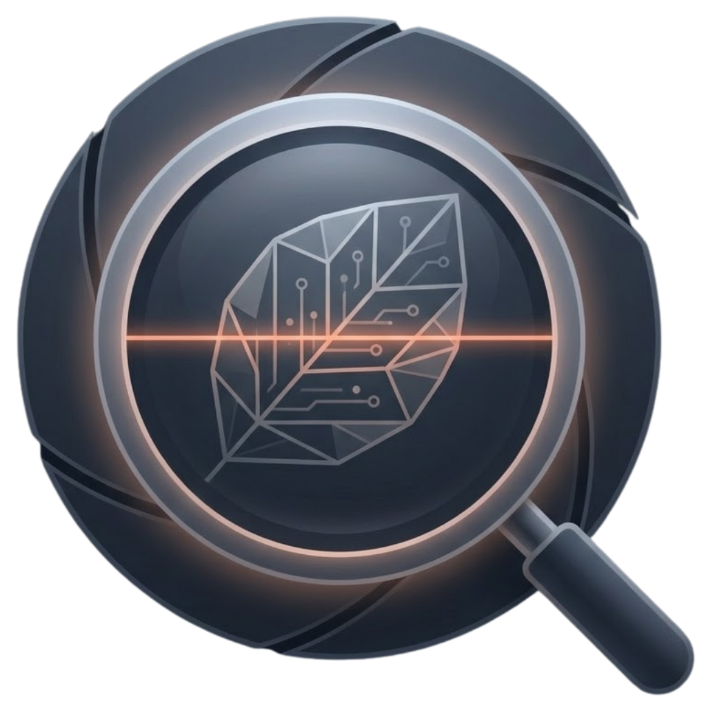
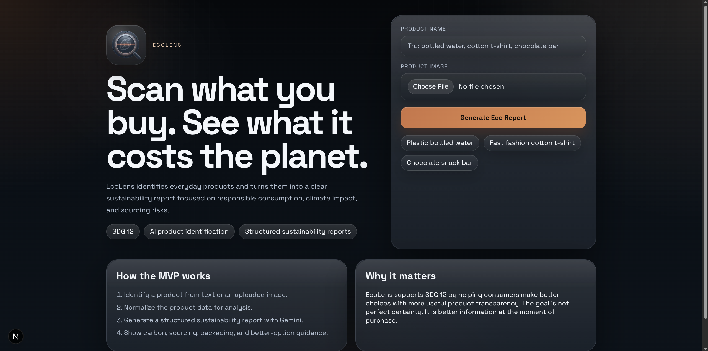
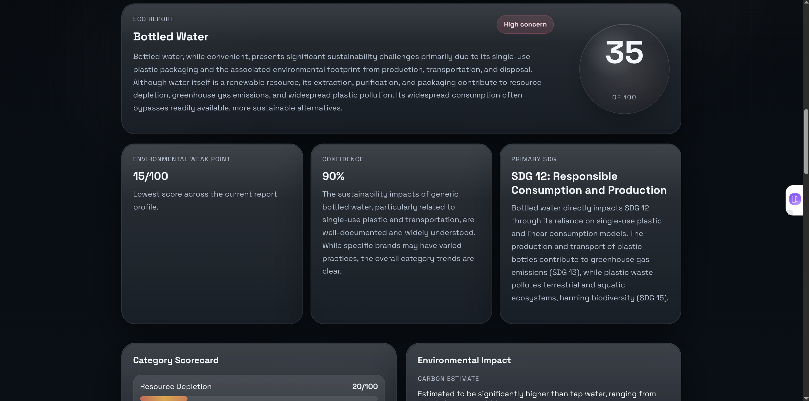
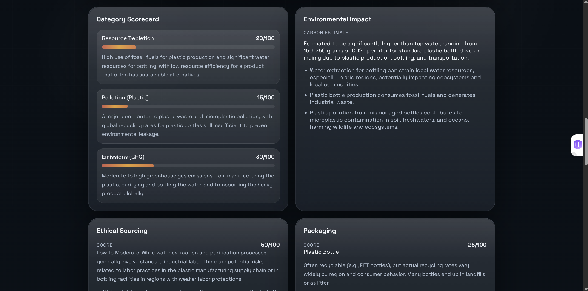
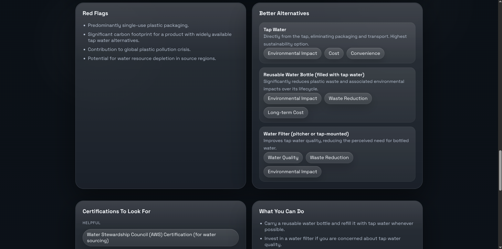
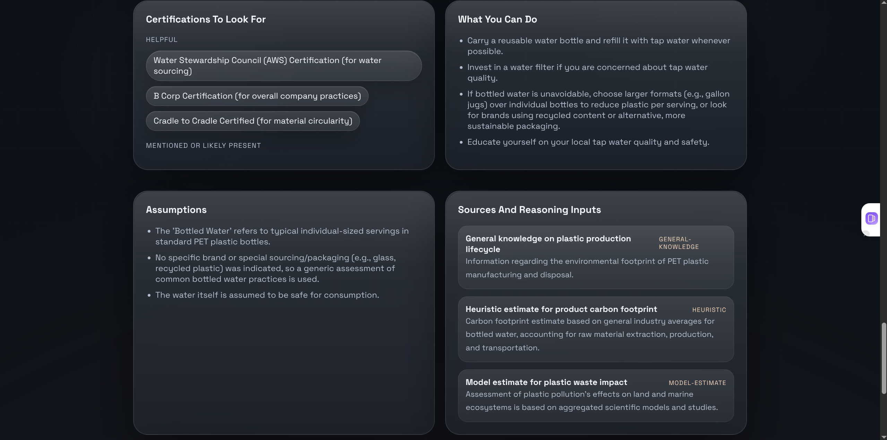
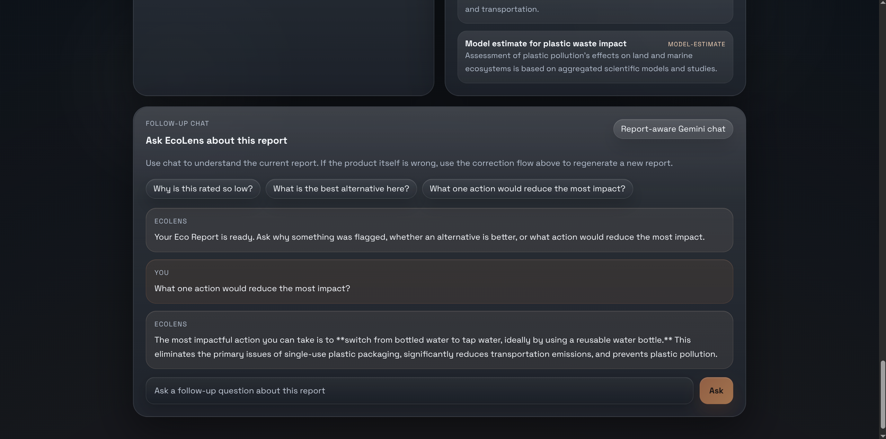

# EcoLens

<p align="center">
  
</p>

EcoLens is an AI-powered responsible consumption scanner focused on sustainability, consumer education, and practical AI. The app lets a user upload a product image or type a product name, identifies the item, and generates a structured sustainability report with environmental, ethical, packaging, and action-oriented guidance.

The goal is simple: give people better information at the moment of purchase so they can make more responsible choices without needing to read long reports or search across multiple sustainability sources on their own.

## Live Demo

EcoLens is currently deployed at:

- App: `https://ecolens.pinkpixel.dev`
- Repository: `https://github.com/pinkpixel-dev/ecolens`

Demo video:

- `https://youtu.be/s3EjDCPtkrY`

## Submission Snapshot

- Problem: Sustainability information is hard to access quickly while shopping.
- Solution: EcoLens turns a product name or image into a clear AI-generated sustainability report.
- Audience: Everyday consumers who want practical guidance, not long research documents.
- Core value: Fast, understandable decision support tied to responsible consumption.

## Screenshots

<p align="center">
  
  
</p>

<p align="center">
  
  
</p>

<p align="center">
  
  
</p>

## Why EcoLens Exists

Consumers often want to make better purchasing decisions, but product sustainability data is fragmented, inconsistent, or too technical to use in a real shopping moment. EcoLens addresses that gap by turning messy product information into a clear, fast, and understandable sustainability summary.

This project is designed around:

- `SDG 12`: Responsible Consumption and Production
- `SDG 13`: Climate Action
- `SDG 8`: Decent Work and Economic Growth
- `SDG 15`: Life on Land

The strongest alignment is with SDG 12.8, which focuses on ensuring people have the information needed for sustainable lifestyles.

## What The MVP Does

EcoLens currently supports the full core demo loop:

1. A user enters a product name or uploads an image.
2. Gemini identifies and normalizes the product into a typed structure.
3. Gemini generates a structured `EcoReport`.
4. The UI presents a report with scores, red flags, alternatives, and suggested actions.
5. The user can ask follow-up questions in a report-aware chat.
6. If the product was identified incorrectly, the user can correct it and regenerate the report.

## Key Features

- AI-powered product identification from text or image input
- Two-step AI pipeline for better report consistency
- Structured sustainability analysis with typed validation
- Category-based scorecards for environmental impact
- Ethical sourcing and packaging breakdowns
- Better alternative recommendations
- Consumer action tips
- Confidence and assumptions displayed to the user
- Report-aware follow-up chat
- Product correction and report regeneration flow
- Demo-friendly example product prompts

## Current Project Status

The current build includes:

- Next.js App Router application
- TypeScript across frontend and backend
- Gemini integration via `@google/genai`
- Zod schemas for product identification, reports, and chat contracts
- `POST /api/identify`, `POST /api/analyze`, and `POST /api/chat` routes
- A polished single-page demo flow for generating and exploring reports
- Fixture data for reliable demo examples
- Local lint, typecheck, and production build support

## Product Experience

The homepage is built around a simple interaction:

- Enter a product name manually
- Upload a product photo
- Try a preloaded demo product
- Generate an Eco Report
- Inspect the report sections
- Ask follow-up questions about the generated result
- Correct the product name if the original identification was slightly off

The report UI includes:

- Overall sustainability score
- Environmental scorecard
- Carbon footprint estimate
- Land, water, and biodiversity notes
- Ethical sourcing score and sourcing notes
- Packaging score and recyclability notes
- Red flags
- Useful certifications
- Better alternatives
- Consumer tips
- Assumptions
- Reasoning inputs and source notes
- Confidence explanation

## Architecture

EcoLens uses a two-pass AI pipeline.

### Pass 1: Product Identification

The app accepts a product name, image, or both. Gemini normalizes the input into a structured product object that includes fields such as:

- product name
- brand
- category
- description
- materials or ingredients
- packaging type
- likely use case
- identification confidence

This step makes the second step more reliable because the sustainability analysis works from normalized product data instead of directly from a raw image.

### Pass 2: Sustainability Analysis

The normalized product object is passed into a second Gemini prompt that returns a structured `EcoReport`. The JSON is validated with Zod before the UI consumes it.

The report includes:

- overall score
- SDG alignment
- environmental impact scorecard
- ethical sourcing summary
- packaging analysis
- red flags
- certifications
- better alternatives
- consumer tips
- assumptions
- confidence
- source and reasoning metadata

### Follow-Up Chat

After a report is generated, the chat route injects the current report into a Gemini interaction so the user can ask contextual questions like:

- Why is this product rated so low?
- Which alternative is most sustainable?
- What single change would reduce the biggest impact?

This avoids re-running full analysis for each question and makes the experience feel more interactive in a demo.

## Tech Stack

- `Next.js 16`
- `React 19`
- `TypeScript`
- `@google/genai`
- `Zod`
- `ESLint`

## Project Structure

```text
src/
  app/
    api/
      identify/route.ts
      analyze/route.ts
      chat/route.ts
    globals.css
    layout.tsx
    page.tsx
  components/
    app-shell.tsx
  lib/
    gemini/
      client.ts
      prompts.ts
      service.ts
    schemas/
      chat.ts
      product.ts
      report.ts

fixtures/
  *.identify.json
  *.report.json
```

## API Overview

### `POST /api/identify`

Accepts:

- `productName`
- `imageBase64`
- `imageMimeType`

Returns a normalized product object validated against the product schema.

### `POST /api/analyze`

Accepts:

- `product`

Returns a typed `EcoReport` with sustainability analysis.

### `POST /api/chat`

Accepts:

- `report`
- `message`
- optional previous interaction id

Returns a report-aware Gemini response for follow-up questions.

## Local Development

### Prerequisites

- Node.js 20+ recommended
- npm
- A Gemini API key

### Setup

1. Install dependencies:

```bash
npm install
```

2. Create your local environment file:

```bash
cp .env.example .env.local
```

3. Add the required environment variables:

```bash
GEMINI_API_KEY=your_key_here
GEMINI_MODEL=gemini-2.5-flash
```

4. Start the development server:

```bash
npm run dev
```

5. Open `http://localhost:3000`

## Available Scripts

```bash
npm run dev
npm run build
npm run start
npm run lint
npm run typecheck
```

## Demo Products

The app includes demo-friendly product examples:

- Plastic bottled water
- Fast fashion cotton t-shirt
- Chocolate snack bar

The repository also includes fixtures for these examples so the demo remains stable and repeatable.

## Limitations

EcoLens is an MVP and should be understood as an AI-assisted sustainability guidance tool, not a scientific auditing platform.

Current limitations include:

- estimates are model-assisted rather than product-manufacturer verified
- results depend on recognizable product information and prompt quality
- the app does not yet integrate live retailer or certification databases
- carbon and sourcing assessments are directional rather than compliance-grade
- coverage is stronger for common consumer goods than niche or obscure products

These tradeoffs are reasonable for an MVP focused on fast consumer education, interactive usability, and a clear demonstration of AI-assisted decision support.

## Roadmap

Next improvements for the project include:

- stronger loading, empty, and error states
- broader sustainability data retrieval for better grounding
- shareable eco-score so users can post their results on social media
